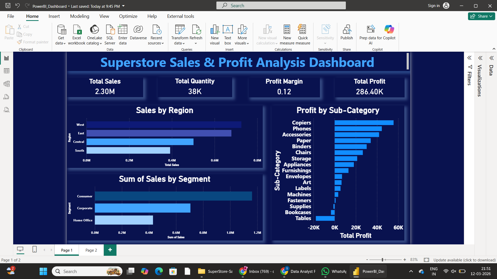
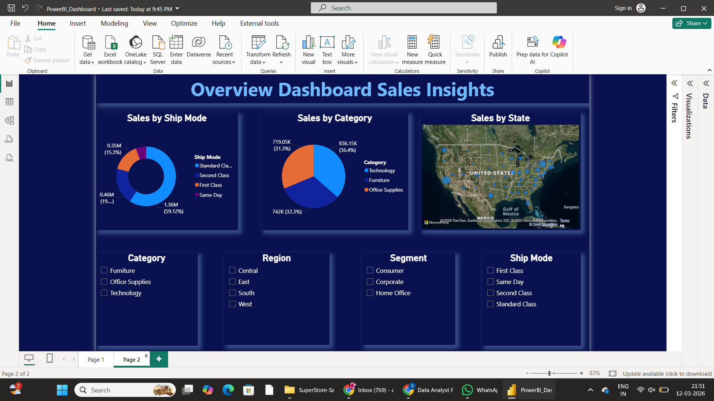

# Superstore Sales & Profit Analysis

## Project Overview

This project analyzes a retail Superstore dataset to identify sales trends, profit performance, and regional insights.

The goal is to demonstrate **data analysis skills using SQL and Power BI**.

## Tools Used

* SQL
* Microsoft Power BI
* Data Visualization
* Business Analysis

## Dataset

The dataset contains around **9,994 sales records** including:

* Region
* Category
* Sub-Category
* Sales
* Profit
* Quantity
* Ship Mode
* Segment
* State & City

## Dashboard Features

### KPI Metrics

* Total Sales
* Total Profit
* Total Quantity
* Profit Margin

### Visualizations

* Sales by Region
* Profit by Sub-Category
* Sales by Category
* Sales by Ship Mode
* Sales by State Map

### Filters

* Category
* Region
* Segment
* Ship Mode

## Key Insights

* West region generates the highest sales.
* Technology category contributes the most revenue.
* Copiers and Phones are the most profitable products.
* Tables sub-category produces negative profit.
* Standard Class is the most used shipping mode.

## Project Files

* dataset.csv – Raw dataset
* sql_analysis.sql – SQL queries used for analysis
* powerbi_dashboard.pbix – Power BI dashboard
* dashboard screenshots – Visualization preview

## Dashboard Preview

## Author

Dhanushya S

